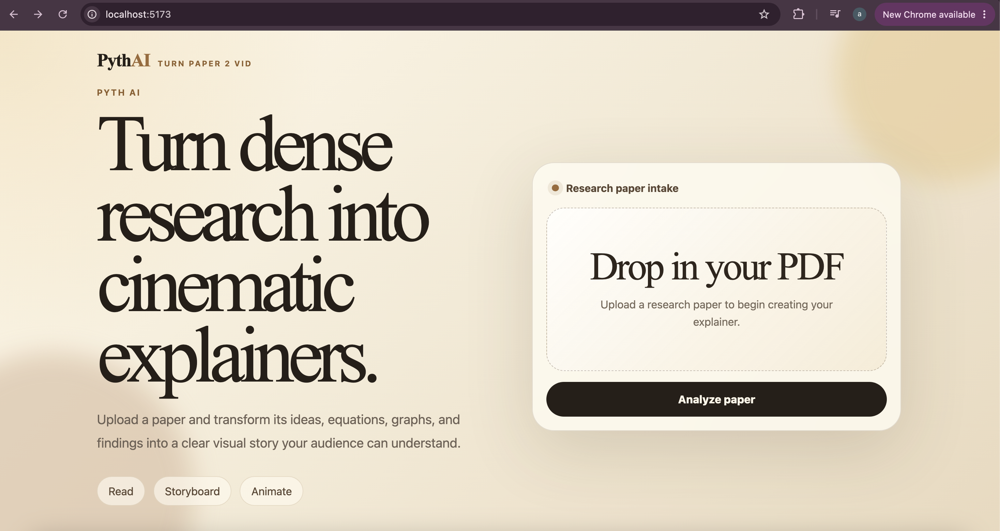
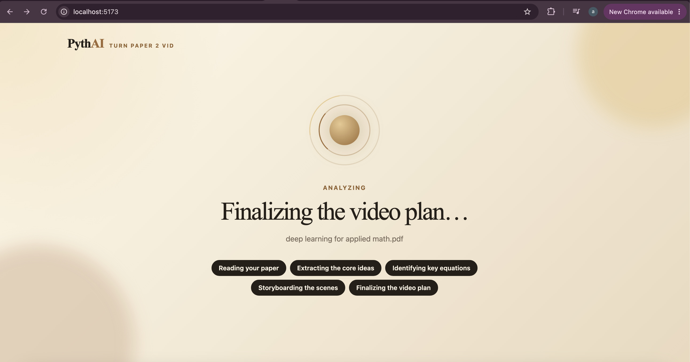
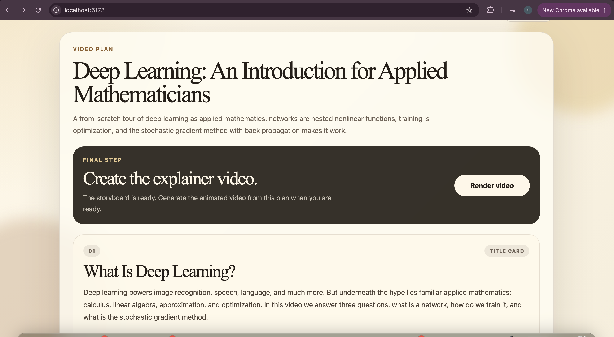
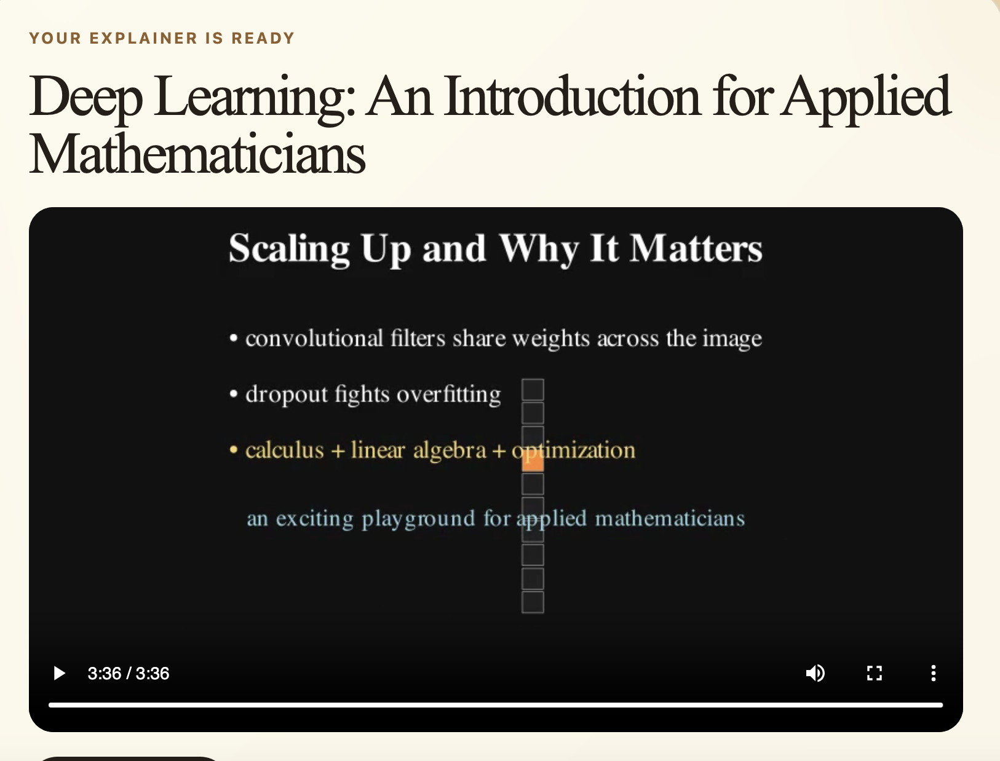

# Pyth AI — turn paper 2 vid

Upload a research paper (PDF) and get back a narrated, animated explainer video.

- **Plan** — Claude reads the paper and produces a structured storyboard (title, summary, and scene-by-scene beats).
- **Render** — a Claude agent writes [Manim](https://www.manim.community/) code for each beat, renders it, adds text-to-speech narration, and stitches everything into one MP4.

## Demo

https://github.com/user-attachments/assets/8996912c-0880-4114-98b1-9cbdee9e0f14

▶️ Sample output — also saved in [`assets/final.mp4`](assets/final.mp4).

📄 Source paper: [Deep Learning: An Introduction for Applied Mathematicians](assets/deep%20learning%20for%20applied%20math.pdf) — the exact PDF used to generate the demo above.

## Screenshots

| Upload | Analyzing | Storyboard | Video |
|---|---|---|---|
|  |  |  |  |

## Stack

- **Backend** — FastAPI + Manim + Claude Agent SDK (`backend/`)
- **Frontend** — React + Vite (`frontend/`)

## Quick start

**1. One-time setup** (installs system deps, Python venv, and packages):

```bash
cd backend && ./setup.sh
```

**2. Add your Anthropic API key** to `backend/.env`:

```bash
ANTHROPIC_API_KEY=sk-ant-...
```

**3. Start everything** from the repo root:

```bash
./start.sh
```

This launches the API on `http://127.0.0.1:8000` and the app on `http://127.0.0.1:5173`. Open the app, upload a paper, review the plan, and render.

## How it works

1. `POST /papers/ingest` — extracts PDF text and calls Claude once to generate the storyboard JSON.
2. `POST /videos/render` — runs the render in the background; beats are rendered in parallel.
3. `GET /videos/render/{job_id}` — poll for live progress; the finished MP4 is served from `/outputs`.

Job artifacts (plans, scenes, audio, video) are written to `backend/work/` (git-ignored).

## Notes

- `start.sh` runs the backend **without** `--reload` on purpose — the file watcher would otherwise restart the server mid-render and kill the job.
- Requires Homebrew, Python 3, Node.js, and FFmpeg (installed via `setup.sh`).
